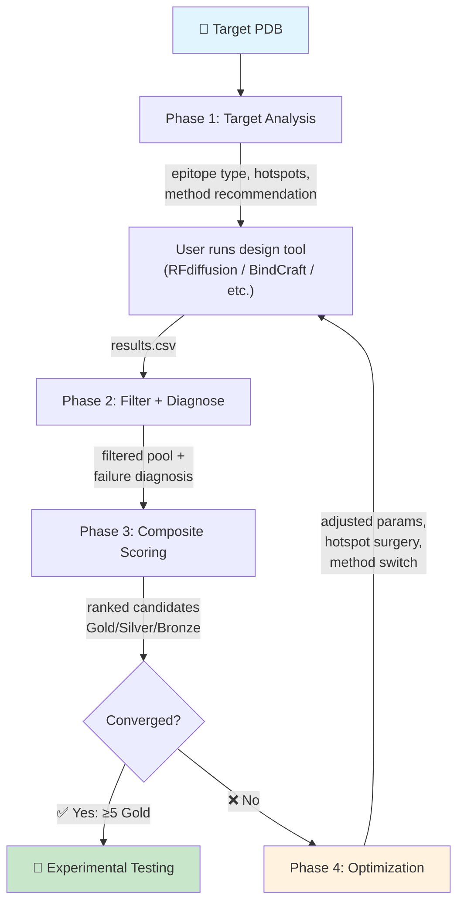
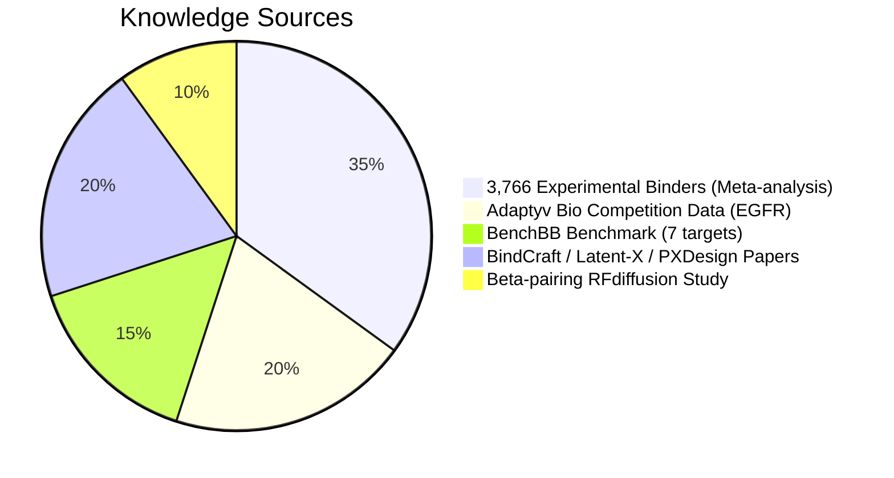
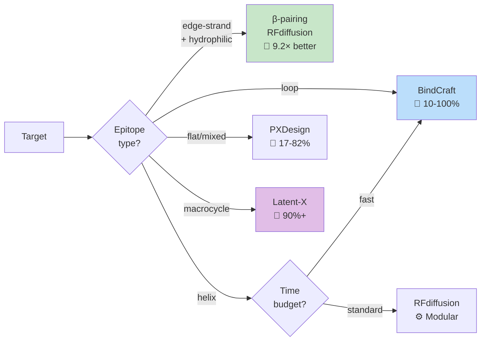

<div align="center">

```
    ____             __       _          ____            _                ______                      __
   / __ \________  / /____  (_)___     / __ \___  _____(_)___ _____     / ____/  ______  ___  _____/ /_
  / /_/ / ___/ _ \/ __/ _ \/ / __ \   / / / / _ \/ ___/ / __ `/ __ \  / __/ | |/_/ __ \/ _ \/ ___/ __/
 / ____/ /  / (_) / /_/  __/ / / / /  / /_/ /  __(__  ) / /_/ / / / / / /____>  </ /_/ /  __/ /  / /_
/_/   /_/   \___/\__/\___/_/_/ /_/  /_____/\___/____/_/\__, /_/ /_/ /_____/_/|_/ .___/\___/_/   \__/
                                                       /____/                  /_/
```

**The expert brain behind your protein binder design campaigns.**

[](https://python.org)
[](LICENSE)
[]()
[]()
[]()

[Features](#-features) · [Quick Start](#-quick-start) · [Demo](#-full-demo-egfr-binder-campaign) · [Architecture](#-architecture) · [Citation](#-citation)

</div>

---

> **The gap between running AlphaFold and designing a successful binder is expert knowledge.**
>
> Tools like RFdiffusion and BindCraft generate candidates — but which method should you pick? What thresholds should you use? Why are 90% of your designs failing? When should you switch strategies?
>
> **Protein Design Expert** encodes answers to these questions from **3,766+ experimentally validated binders**, competition data, and recent publications into an actionable decision engine.

---

## 🧬 What This Does

Most protein design tools are **wrenches** — they do one thing. This project is the **engineer holding the wrench**, telling you:

| Instead of... | This system gives you... |
|:---|:---|
| "Here's 10,000 designs" | "Here are **8 gold-tier** candidates ranked by composite score" |
| "ipTM = 0.72" | "**Type II failure** — interface too small. Extend binder by 30 residues" |
| "Try RFdiffusion" | "Your target is edge-strand + hydrophilic → use **β-pairing RFdiffusion** (9.2× improvement)" |
| "Run another round" | "Plateaued after 2 rounds → **switch to BindCraft**, add hotspots at 112, 118" |

---

## ✨ Features

<table>
<tr>
<td width="50%">

### 🎯 Phase 1: Target Analysis
- Epitope classification (helix/loop/flat/concave/edge-strand)
- Surface hydrophilicity assessment
- Automated hotspot selection (3-6 residues)
- Method recommendation with success rates

</td>
<td width="50%">

### 🔬 Phase 2: Design Diagnosis
- Type I/II failure mode classification
- 7 diagnostic rules with root cause analysis
- Pool-level systematic issue detection
- Actionable fix recommendations

</td>
</tr>
<tr>
<td width="50%">

### 📊 Phase 3: Composite Scoring
- 7-metric weighted scoring (expert-derived weights)
- Gold / Silver / Bronze / Reject tier assignment
- Diversity-aware experimental prioritization
- CSV/JSON export for lab handoff

</td>
<td width="50%">

### 🔄 Phase 4: Iterative Optimization
- Convergence detection (improving/plateaued/diverging)
- Automatic parameter adjustment rules
- Method switch recommendations
- Round-by-round history tracking

</td>
</tr>
</table>

### Dual Interface

```
┌─────────────────────────────────────────────────┐
│  🖥️  CLI Tool                                    │
│  python target_analyzer.py target.pdb --chain A  │
│  python filter_engine.py results.csv --summary   │
│  python design_scorer.py filtered.csv            │
└─────────────────────────────────────────────────┘
                      +
┌─────────────────────────────────────────────────┐
│  🤖  LLM Agent Skill (Claude Code)              │
│  "Design a binder for EGFR domain III"           │
│  "Why are my designs failing?"                   │
│  "Score these candidates for experimental test"  │
└─────────────────────────────────────────────────┘
```

---

## 🚀 Quick Start

### Installation

```bash
git clone https://github.com/jhxu003/protein-design-expert.git
cd protein-design-expert
# Zero dependencies — pure Python stdlib. Just run it.
```

### 30-Second Example

```bash
cd skills/protein-binder-design/scripts

# 1️⃣ Analyze your target
python target_analyzer.py your_target.pdb --chain A --epitope 340 352 364 376

# 2️⃣ After running your design tool (RFdiffusion/BindCraft/etc.), diagnose results
python filter_engine.py results.csv --tier standard --summary
python diagnosis_engine.py results.csv --output diagnosis.json

# 3️⃣ Score and rank for experiments
python design_scorer.py results.csv --output ranked.csv

# 4️⃣ Plan next round
python optimization_planner.py diagnosis.json scores.json --round 1 --params params.json
```

---

## 🎬 Full Demo: EGFR Binder Campaign

<details>
<summary><b>Click to see a complete end-to-end workflow with real PDB</b></summary>

### Step 1: Target Analysis (PDB 1NQL — EGFR Domain III)

```bash
$ python target_analyzer.py 1NQL.pdb --chain A --epitope 340 344 348 352 356 360 364 368 372 376 380
```

```
Target:  1NQL, chain A
Epitope: residues 340-380 (16 residues)
Type:    helix
Hydrophilicity: 0.69 (hydrophilic)

HOTSPOT RECOMMENDATION
  Residues: 340, 352, 364, 376, 388
  Distribution: good
  Rationale: every 3-4 residues along helix face

METHOD RANKING
  #1  BindCraft               score=75  ← Recommended
  #2  beta-pairing-RFdiffusion score=65
  #3  RFdiffusion              score=60

⚠ Warning: Hydrophilic surface — standard RFdiffusion may underperform
```

### Step 2: Filter 500 Designs

```bash
$ python filter_engine.py egfr_round1_results.csv --tier standard --summary
```

```
Filter results (standard tier):
  Pass:        31 (6.2%)
  Gray zone:   98
  Fail:       371
  Total:      500

Top failure reasons:
  hotspot_contact: 224
  iptm: 223
  interface_area: 206
```

### Step 3: Diagnose Failures

```bash
$ python diagnosis_engine.py egfr_round1_results.csv
```

```
Failure Distribution:
  partial_misfolding        97 (19.4%) █████████
  no_binding_predicted      86 (17.2%) ████████
  weak_binding              76 (15.2%) ███████
  severe_misfolding         71 (14.2%) ███████

Dominant failure: partial_misfolding
→ Fix: Increase ProteinMPNN sampling, lower temperature
```

### Step 4: Score & Rank

```bash
$ python design_scorer.py egfr_round1_results.csv --output ranked.csv
```

```
Tier distribution:
     gold:    8 (  1.6%)
   silver:   72 ( 14.4%) #######
   bronze:  203 ( 40.6%) ####################
   reject:  217 ( 43.4%) #####################

Top 5:
  Rank  Design ID     Score  Tier    ipTM   pLDDT
     1  egfr_0003     0.850  gold    0.852  1.000
     2  egfr_0007     0.846  gold    1.000  0.907
     3  egfr_0009     0.840  gold    1.000  0.965
     4  egfr_0012     0.826  gold    0.868  0.940
     5  egfr_0011     0.816  gold    0.899  0.958
```

### Step 5: Optimization Decision

```
Convergence: ✅ REACHED
  Gold-tier designs: 8 >= 5 (threshold met)
  → Proceed to experimental validation
```

**Result: From 500 raw designs → 8 high-confidence candidates in one pipeline run.**

</details>

---

## 🏗️ Architecture



### Expert Knowledge Encoded



### Method Decision Engine



---

## 📂 Project Structure

```
protein-design-expert/
├── skills/
│   ├── protein-binder-design/          # 🎯 Main orchestrator skill
│   │   ├── SKILL.md                    # LLM agent instructions
│   │   ├── references/
│   │   │   ├── method_database.md      # 5 methods: RFdiff, BindCraft, Latent-X, PXDesign, β-pairing
│   │   │   ├── filtering_thresholds.md # Standard & stringent threshold tables
│   │   │   ├── failure_modes.md        # Type I/II failure taxonomy + diagnostic flowchart
│   │   │   ├── decision_trees.md       # Method selection, hotspot, convergence trees
│   │   │   └── case_studies.md         # 4 end-to-end worked examples
│   │   └── scripts/
│   │       ├── pdb_utils.py            # PDB parser (zero dependencies)
│   │       ├── target_analyzer.py      # Phase 1: epitope + hotspot + method
│   │       ├── method_selector.py      # 5-method decision engine
│   │       ├── filter_engine.py        # Phase 2: tiered filtering
│   │       ├── diagnosis_engine.py     # Phase 2: failure classification
│   │       ├── design_scorer.py        # Phase 3: composite scoring
│   │       └── optimization_planner.py # Phase 4: iterative optimization
│   ├── protein-binder-target-analysis/ # Phase 1 standalone skill
│   ├── protein-binder-diagnosis/       # Phase 2 standalone skill
│   ├── protein-binder-scoring/         # Phase 3 standalone skill
│   └── protein-binder-optimization/    # Phase 4 standalone skill
├── demo/                               # Full EGFR demo with data
└── tests/                              # Integration tests (9/9 passing)
```

---

## 🧠 Expert Knowledge at a Glance

<details>
<summary><b>📋 Filtering Thresholds</b></summary>

| Metric | Pass | Gray Zone | Fail | Direction |
|:-------|:----:|:---------:|:----:|:---------:|
| **ipSAE rank** | Top 600 | — | > 600 | Lower = better |
| **ipTM** | ≥ 0.80 | 0.60 – 0.80 | < 0.60 | Higher = better |
| **pLDDT** | ≥ 0.85 | 0.70 – 0.85 | < 0.70 | Higher = better |
| **PAE** | ≤ 12 Å | 12 – 18 Å | > 18 Å | Lower = better |
| **Interface area** | 1000–1600 Ų | 850–1000 Ų | < 850 Ų | In range |
| **Cα RMSD** | ≤ 2.0 Å | 2.0 – 3.0 Å | > 3.0 Å | Lower = better |
| **Hotspot contact** | 0.25 – 0.50 | 0.20 – 0.25 | < 0.20 | In range |

</details>

<details>
<summary><b>🔍 Failure Diagnosis Rules</b></summary>

| Failure | Signature | Priority | Top Fix |
|:--------|:----------|:--------:|:--------|
| Severe misfolding | RMSD > 2, pLDDT < 0.7 | 🔴 | Simplify backbone topology |
| Partial misfolding | RMSD > 2, pLDDT ≥ 0.7 | 🟠 | Add sequence constraints |
| No binding signal | RMSD ≤ 2, ipTM < 0.6 | 🟠 | Switch to BindCraft |
| Interface too small | ipTM gray, area < 850 | 🟡 | Extend binder length |
| Poor hotspot | contact < 0.2 | 🟠 | Add 2-3 more hotspots |
| Over-constrained | contact > 0.5 | 🟡 | Reduce hotspot count |
| Weak binding | RMSD ok, ipTM gray, area ok | 🟡 | Optimize interface packing |

</details>

<details>
<summary><b>⚖️ Scoring Weights</b></summary>

| Metric | Weight | Rationale |
|:-------|:------:|:----------|
| **ipSAE** | 30% | Best single predictor (1.4× better than ipAE) |
| **ipTM** | 25% | Strong interface confidence signal |
| **pLDDT** | 15% | Structural confidence |
| **PAE** | 10% | Complementary to ipTM |
| **Interface area** | 10% | Geometric constraint |
| **Shape complementarity** | 5% | Packing quality |
| **Hotspot contact rate** | 5% | Design-specific engagement |

Weights derived from meta-analysis of 3,766 experimentally characterized binders.

</details>

<details>
<summary><b>🔄 Method Comparison</b></summary>

| Method | Success Rate | Speed | Best For |
|:-------|:------------|:------|:---------|
| **BindCraft** | 10-100% 🔥 | Fast (one-shot) | Loop epitopes, rapid iteration |
| **Latent-X** | 90%+ (macrocycles) | 10× faster | Macrocycles, max affinity |
| **PXDesign** | 17-82% | Medium | Diverse targets, mixed epitopes |
| **RFdiffusion** | 0.4-7.5% baseline | Slow (pipeline) | Helical epitopes, motif scaffolding |
| **β-pairing RFdiff** | 9.2% (vs 0.98%) | Medium | Edge-strand, hydrophilic targets |

</details>

---

## 🤖 Use as Claude Code Skill

Add the skills directory to your Claude Code configuration:

```bash
# The skills are auto-discovered from SKILL.md files
# Just point Claude Code to the skills/ directory
```

Then interact naturally:

```
> I want to design a binder for PD-L1. The epitope is a beta-sheet
  face around residues 54-72. What method should I use?

> Here are my RFdiffusion results (results.csv).
  Why is my pass rate only 2%?

> Score these 500 designs and tell me which ones to test.
```

---

## 📚 References

This system's expert knowledge is derived from:

- **BindCraft** — Pacesa et al., *Nature* 2025. One-shot binder design.
- **Latent-X** — Khalil et al., 2025. All-atom frontier model.
- **PXDesign** — 2025. Fast modular binder design.
- **β-pairing RFdiffusion** — Sahtoe et al., *Nature Communications* 2026.
- **ipSAE scoring** — Meta-analysis of 3,766 binders, *bioRxiv* 2025.
- **RFdiffusion** — Watson et al., *Nature* 2023.
- **ProteinMPNN** — Dauparas et al., *Science* 2022.
- **BenchBB** — Adaptyv Bio benchmark, 7 diverse targets.
- **Adaptyv EGFR Competition** — Crowdsourced binder design, 378 proteins tested.

---

## 📄 Citation

If you use this tool in your research, please cite:

```bibtex
@software{protein_design_expert,
  title={Protein Design Expert: Expert-Knowledge-Driven Skill System for Protein Binder Design},
  author={Xu, Jinhang},
  year={2026},
  url={https://github.com/jhxu003/protein-design-expert}
}
```

---

## ⚖️ License

MIT License — free for academic and commercial use.

---

<div align="center">

**Built with domain expertise, not just code.**

*If this saves you a failed experiment, consider giving it a ⭐*

</div>
